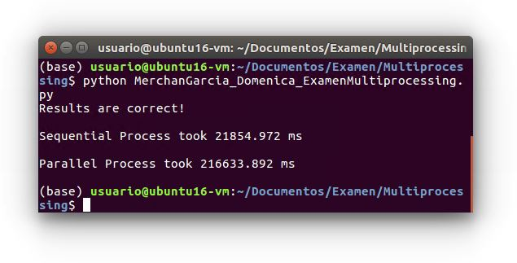

# Examen Multiprocessing

Para este algoritmo se dividió el número de filas de la matriz 4000000x10 entre 8 procesos. Cada proceso estuvvo a cargo de realizar el 
conteo de los valores dentro de un rango establecido y los resultados se los fue agregando a una lista compartica, creada con un manager.

En este caso el tiempo de ejecución no mejoró como fue el caso de paralelismo utilizando la librería mpi4py. El algoritmo se ejecura 
mediante la siguiente línea de comando

### python MerchanGarcia_Domenica_ExamenMultiprocessing.py

